# MITA Protocol Technical Specification

## Overview

MITA is a secure, transport-agnostic communication protocol designed for IoT networks.

## Design Goals

The MITA protocol is engineered with the following objectives:

- **Security-First Architecture**: Cryptographically authenticated sessions with forward secrecy
- **Attack Resistance**: Built-in protections against replay attacks, DoS, session hijacking, and packet injection
- **Transport Independence**: Abstract protocol layer supporting WiFi, BLE, and future transports
- **Resource Efficiency**: Optimized for constrained IoT devices (ESP32, embedded systems)
- **Reliability**: Quality of Service (QoS) mechanisms, acknowledgments, and error recovery
- **Scalability**: Support for mesh routing with TTL-based forwarding

## Table of Contents

1. [Protocol Packet Structure](#1-protocol-packet-structure)
2. [Message Types and Protocol States](#2-message-types-and-protocol-states)
3. [Authentication Flow (Handshake Protocol)](#3-authentication-flow-handshake-protocol)
4. [Cryptographic Architecture](#4-cryptographic-architecture)
5. [Data Flow and Packet Processing](#5-data-flow-and-packet-processing)
6. [Security Mechanisms - Replay Attack Prevention](#6-security-mechanisms---replay-attack-prevention)
7. [Security Mechanisms - DoS Prevention](#7-security-mechanisms---dos-prevention)
8. [Security Mechanisms - Transport Fingerprinting](#8-security-mechanisms---transport-fingerprinting)
9. [Session Management](#9-session-management)
10. [Quality of Service Features](#10-quality-of-service-features)
11. [Error Handling and Recovery](#11-error-handling-and-recovery)
12. [Transport Layer Abstraction](#12-transport-layer-abstraction)
13. [Checksum and Integrity Verification](#13-checksum-and-integrity-verification)
14. [Protocol Architecture and Implementation](#14-protocol-architecture-and-implementation)

---

## 1. Protocol Packet Structure

### 1.1 Packet Format Overview

The MITA protocol packet consists of a fixed 19-byte header followed by a variable-length payload (0-256 bytes). The total maximum packet size is 275 bytes.

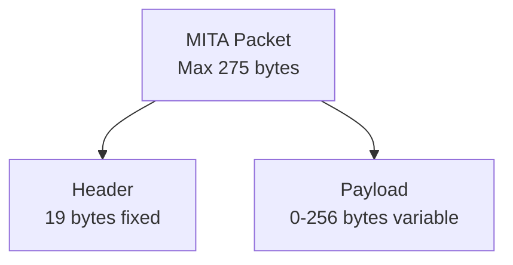
```mermaid
graph TD
    A[MITA Packet<br/>Max 275 bytes] --> B[Header<br/>19 bytes fixed]
    A --> C[Payload<br/>0-256 bytes variable]
```

### 1.2 Header Structure

The protocol header is carefully designed to be compact yet feature-rich, supporting routing, security, QoS, and fragmentation.

| Byte Offset | Field Name | Size | Description |
|-------------|------------|------|-------------|
| 0 | version_flags | 1 byte | Protocol version (4 bits) + flags (4 bits) |
| 1 | msg_type | 1 byte | Message type identifier |
| 2-3 | source_addr | 2 bytes | Source device address (big-endian) |
| 4-5 | dest_addr | 2 bytes | Destination address (big-endian) |
| 6 | payload_length | 1 byte | Length of payload (0-256) |
| 7-8 | checksum | 2 bytes | CRC-16-CCITT checksum (big-endian) |
| 9-10 | sequence_number | 2 bytes | Packet sequence number (big-endian) |
| 11 | ttl | 1 byte | Time-to-live for routing |
| 12 | priority_flags | 1 byte | Priority (2 bits) + QoS/Fragment flags (6 bits) |
| 13-14 | fragment_id | 2 bytes | Fragment identifier (big-endian) |
| 15-18 | timestamp | 4 bytes | timestamp in seconds (big-endian) |

### 1.3 Header Field Descriptions

#### version_flags (Byte 0)

| Bits | Field | Values |
|------|-------|--------|
| 7-4 | Protocol Version | Currently 1 |
| 3-0 | Flags | Bit 0: FLAG_ENCRYPTED (0x01)<br/>Bits 1-3: Reserved |

#### msg_type (Byte 1)
Identifies the message type. See Section 2 for complete message type enumeration.

#### source_addr and dest_addr (Bytes 2-5)
- 16-bit addresses assigned by the router
- `0x0000`: Router address or unassigned
- `0xFFFF`: Broadcast address
- `0x0001-0xFFFE`: Individual device addresses

#### payload_length (Byte 6)
Number of bytes in the payload section (0-256). Maximum payload size is defined by `MAX_PAYLOAD_SIZE`.

#### checksum (Bytes 7-8)
CRC-16-CCITT checksum computed over all header fields (excluding the checksum itself) and payload.
- Polynomial: 0x1021
- Initial value: 0xFFFF
- Purpose: Transport-level error detection (NOT for security)

**Important**: The CRC-16 is for detecting transmission errors only. Cryptographic integrity is provided by AES-GCM authentication tags.

#### sequence_number (Bytes 9-10)
16-bit monotonically increasing counter used for:
- Replay attack prevention
- Packet ordering
- Duplicate detection
- Sliding window validation (see Section 6)

#### ttl (Byte 11)
Time-to-live counter for mesh routing:
- Default value: 16
- Decremented at each hop
- Packet dropped when TTL reaches 0
- Prevents routing loops

#### priority_flags (Byte 12)

Combines priority level and control flags:

| Bits | Flag Name | Value | Description |
|------|-----------|-------|-------------|
| 1-0 | Priority Level | 0x00 | PRIORITY_LOW |
| | | 0x01 | PRIORITY_NORMAL (default) |
| | | 0x02 | PRIORITY_HIGH |
| | | 0x03 | PRIORITY_CRITICAL |
| 2 | FLAG_FRAGMENTED | 0x04 | Packet is part of fragmented message |
| 3 | FLAG_MORE_FRAGMENTS | 0x08 | More fragments follow |
| 4 | FLAG_QOS_NO_ACK | 0x10 | Fire-and-forget (no ACK needed) |
| 5 | FLAG_QOS_RELIABLE | 0x20 | Reliable delivery (wait for ACK) |
| 6-7 | Reserved | - | Reserved for future use |

#### fragment_id (Bytes 13-14)
Identifier for grouping packet fragments belonging to the same message. Used when FLAG_FRAGMENTED is set.

#### timestamp (Bytes 15-18)
32-bit timestamp in **milliseconds** since device boot:
- **NOT Unix time** - uses relative time (millis() on embedded devices)
- Wraps around every ~49 days (2^32 milliseconds)
- Used for replay attack prevention (packets older than 60 seconds rejected)
- **No RTC required** - works with local device uptime
- **Wrap-around handling** - Router accounts for timestamp wrap-around
- Does not require time synchronization between devices (relative freshness only)

### 1.4 Payload Structure

The payload section (0-256 bytes) contains:
- **For encrypted DATA packets**: IV (12 bytes) + Ciphertext (variable) + GCM Tag (16 bytes)
- **For handshake packets**: Protocol-specific structures (see Section 3)
- **For control packets**: Control-specific data

### 1.5 Packet Structure Diagram

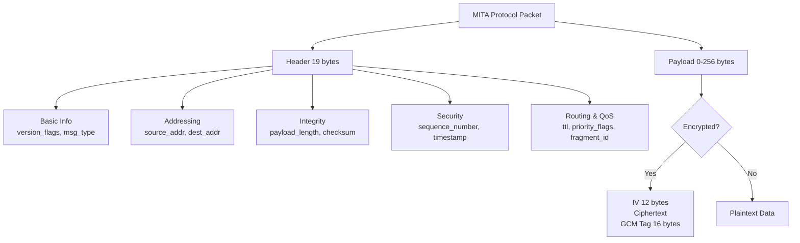
```mermaid
graph TD
    A[MITA Protocol Packet] --> B[Header 19 bytes]
    A --> C[Payload 0-256 bytes]
    
    B --> B1[Basic Info<br/>version_flags, msg_type]
    B --> B2[Addressing<br/>source_addr, dest_addr]
    B --> B3[Integrity<br/>payload_length, checksum]
    B --> B4[Security<br/>sequence_number, timestamp]
    B --> B5[Routing & QoS<br/>ttl, priority_flags, fragment_id]
    
    C --> C1{Encrypted?}
    C1 -->|Yes| C2[IV 12 bytes<br/>Ciphertext<br/>GCM Tag 16 bytes]
    C1 -->|No| C3[Plaintext Data]
```

### 1.6 C Structure Definition

```c
struct BasicProtocolPacket {
    uint8_t  version_flags;           // Byte 0
    uint8_t  msg_type;                // Byte 1
    uint16_t source_addr;             // Bytes 2-3
    uint16_t dest_addr;               // Bytes 4-5
    uint8_t  payload_length;          // Byte 6
    uint16_t checksum;                // Bytes 7-8
    uint16_t sequence_number;         // Bytes 9-10
    uint8_t  ttl;                     // Byte 11
    uint8_t  priority_flags;          // Byte 12
    uint16_t fragment_id;             // Bytes 13-14
    uint32_t timestamp;               // Bytes 15-18
    uint8_t  payload[MAX_PAYLOAD_SIZE]; // 0-256 bytes
};
```

### 1.7 Serialization Details

Packets are serialized in big-endian (network byte order) format:
1. Multi-byte integers are transmitted most-significant byte first
2. The checksum is computed over the entire packet with the checksum field set to zero
3. Padding is not used - the structure is naturally aligned

---

## 2. Message Types and Protocol States

### 2.1 Message Type Enumeration

The MITA protocol defines specific message types for different protocol operations. Each message type is identified by a unique byte value in the packet header.

#### Handshake Messages (0x01-0x04)

| Value | Name        | Direction      | Purpose |
|-------|-------------|----------------|---------|
| 0x01  | HELLO       | Client → Router | Initiate handshake, send device ID and nonce |
| 0x02  | CHALLENGE   | Router → Client | Respond with router's nonce and challenge |
| 0x03  | AUTH        | Client → Router | Authenticate with HMAC proof |
| 0x04  | AUTH_ACK    | Router → Client | Confirm authentication, assign address |

#### Data Messages (0x05-0x06)

| Value | Name | Direction | Purpose |
|-------|------|-----------|---------|
| 0x05  | DATA | Bidirectional | Transport application data (encrypted) |
| 0x06  | ACK  | Bidirectional | Acknowledge receipt of DATA packet |

#### Control Messages (0x07-0x0F)

| Value | Name                | Direction      | Purpose |
|-------|---------------------|----------------|---------|
| 0x07  | CONTROL             | Bidirectional  | Generic control operations |
| 0x08  | HEARTBEAT           | Client → Router | Keep-alive signal |
| 0x09  | DISCONNECT          | Bidirectional  | Graceful session termination |
| 0x0A  | DISCONNECT_ACK      | Bidirectional  | Acknowledge disconnection |
| 0x0B  | SESSION_RESUME      | Client → Router | Resume existing session |
| 0x0C  | SESSION_RESUME_ACK  | Router → Client | Confirm session resumption |
| 0x0D  | SESSION_REKEY_REQ   | Bidirectional  | Request session key rotation |
| 0x0E  | SESSION_REKEY_ACK   | Bidirectional  | Acknowledge key rotation |
| 0x0F  | PING                | Bidirectional  | Connectivity test |

#### Error Messages (0xF0-0xFF)

| Value | Name  | Direction | Purpose |
|-------|-------|-----------|---------|
| 0xFF  | ERROR | Router → Client | Report protocol errors |

### 2.2 Protocol State Machine

The MITA protocol operates through several distinct states during device lifecycle:

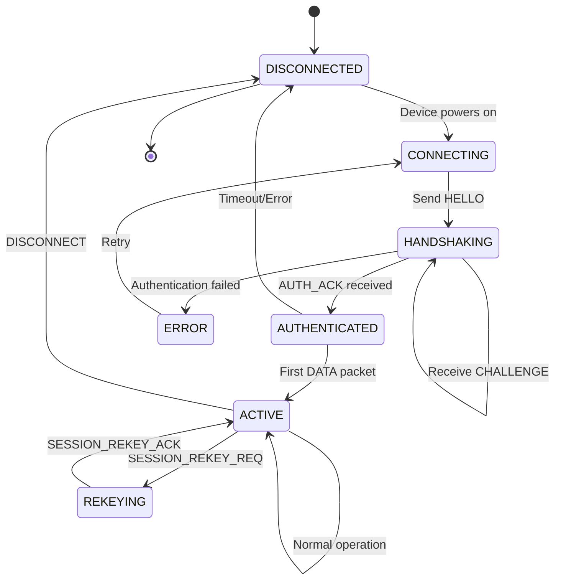
```mermaid
stateDiagram-v2
    [*] --> DISCONNECTED
    DISCONNECTED --> CONNECTING: Device powers on
    CONNECTING --> HANDSHAKING: Send HELLO
    
    HANDSHAKING --> HANDSHAKING: Receive CHALLENGE
    HANDSHAKING --> AUTHENTICATED: AUTH_ACK received
    HANDSHAKING --> ERROR: Authentication failed
    
    AUTHENTICATED --> ACTIVE: First DATA packet
    ACTIVE --> ACTIVE: Normal operation
    
    ACTIVE --> REKEYING: SESSION_REKEY_REQ
    REKEYING --> ACTIVE: SESSION_REKEY_ACK
    
    ACTIVE --> DISCONNECTED: DISCONNECT
    AUTHENTICATED --> DISCONNECTED: Timeout/Error
    ERROR --> CONNECTING: Retry
    DISCONNECTED --> [*]
```

### 2.3 Device State Descriptions

#### DISCONNECTED
- Initial state when device is powered off or connection lost
- No network communication
- All session data cleared

#### CONNECTING
- Device attempting to establish connection
- Transport layer connection initiated (WiFi TCP socket or BLE L2CAP)
- No protocol handshake yet

#### HANDSHAKING
- Four-way handshake in progress
- Exchanging nonces and cryptographic challenges
- Not yet authenticated

#### AUTHENTICATED
- Handshake completed successfully
- Session key derived and stored
- Address assigned by router
- Ready to send/receive data

#### ACTIVE
- Normal operational state
- Exchanging DATA packets
- Heartbeats sent periodically
- Session fully established

#### REKEYING
- Temporary state during session key rotation
- New nonces exchanged
- Session key re-derived for forward secrecy
- Returns to ACTIVE when complete

#### ERROR
- Protocol error detected
- May retry or disconnect based on error type
- Error details logged for debugging

### 2.4 Control Packet Types

CONTROL messages (0x07) have subtypes defined in the first payload byte:

| Value | Name | Description |
|-------|------|-------------|
| 0x00 | PING | Ping request |
| 0x01 | PONG | Ping response |
| 0x02 | TIME_SYNC_REQ | Request time synchronization |
| 0x03 | TIME_SYNC_RES | Time sync response |
| 0x04 | CONFIG_UPDATE | Configuration update |
| 0x05 | FIRMWARE_INFO | Firmware version info |
| 0x06 | CAPABILITIES_REQ | Request device capabilities |
| 0x07 | CAPABILITIES_RES | Capabilities response |

### 2.5 Error Codes

ERROR messages (0xFF) include an error code in the first payload byte:

| Code | Name | Description |
|------|------|-------------|
| 0x01 | INVALID_SEQUENCE | Sequence number out of window |
| 0x02 | STALE_TIMESTAMP | Timestamp too old |
| 0x03 | DECRYPTION_FAILED | GCM authentication failed |
| 0x04 | INVALID_DESTINATION | Unknown destination address |
| 0x05 | TTL_EXPIRED | Packet TTL reached zero |
| 0x06 | RATE_LIMIT_EXCEEDED | Too many packets from device |
| 0x07 | SESSION_EXPIRED | Session key no longer valid |
| 0x08 | MALFORMED_PACKET | Packet structure invalid |
| 0x09 | UNSUPPORTED_VERSION | Protocol version not supported |
| 0x0A | AUTHENTICATION_FAILED | Handshake authentication failed |

### 2.6 Disconnect Reason Codes

DISCONNECT messages (0x09) include a reason code in the payload:

| Code | Name | Description |
|------|------|-------------|
| 0x00 | NORMAL_SHUTDOWN | Clean application shutdown |
| 0x01 | GOING_TO_SLEEP | Device entering sleep mode |
| 0x02 | LOW_BATTERY | Battery critical, preserving power |
| 0x03 | NETWORK_SWITCH | Switching transport (WiFi↔BLE) |
| 0x04 | FIRMWARE_UPDATE | OTA update starting |
| 0x05 | USER_REQUEST | User-initiated disconnect |
| 0xFF | ERROR | Error condition, unspecified |

These codes enable graceful disconnection with context, allowing the router to distinguish between normal shutdowns and error conditions.

---

## 3. Authentication Flow (Handshake Protocol)

The MITA protocol implements a secure four-way handshake for device authentication and session key establishment. This protocol provides mutual authentication, prevents replay attacks, and ensures forward secrecy through ephemeral nonce-based key derivation.

### 3.1 Handshake Sequence Diagram

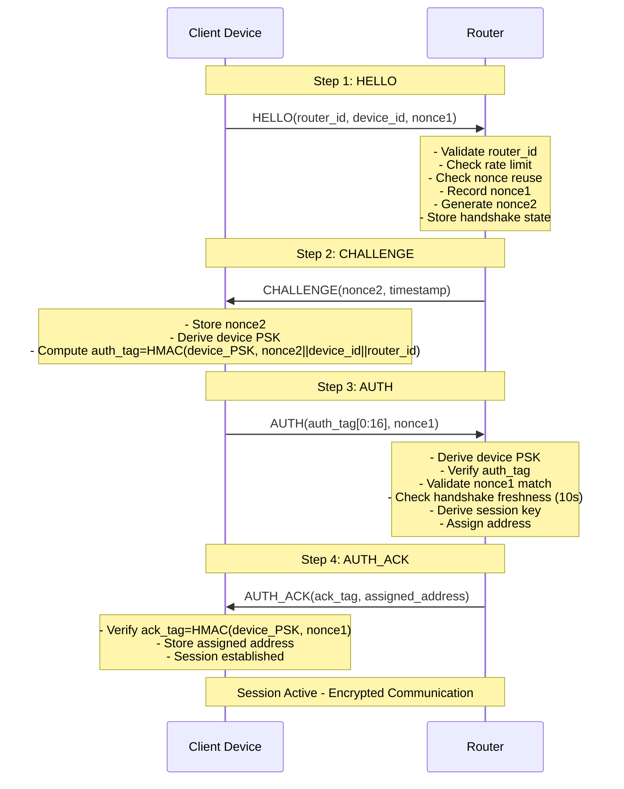
```mermaid
sequenceDiagram
    participant C as Client Device
    participant R as Router
    
    Note over C,R: Step 1: HELLO
    C->>R: HELLO(router_id, device_id, nonce1)
    Note over R: - Validate router_id<br/>- Check rate limit<br/>- Check nonce reuse<br/>- Record nonce1<br/>- Generate nonce2<br/>- Store handshake state
    
    Note over C,R: Step 2: CHALLENGE
    R->>C: CHALLENGE(nonce2, timestamp)
    Note over C: - Store nonce2<br/>- Derive device PSK<br/>- Compute auth_tag=HMAC(device_PSK, nonce2||device_id||router_id)
    
    Note over C,R: Step 3: AUTH
    C->>R: AUTH(auth_tag[0:16], nonce1)
    Note over R: - Derive device PSK<br/>- Verify auth_tag<br/>- Validate nonce1 match<br/>- Check handshake freshness (10s)<br/>- Derive session key<br/>- Assign address
    
    Note over C,R: Step 4: AUTH_ACK
    R->>C: AUTH_ACK(ack_tag, assigned_address)
    Note over C: - Verify ack_tag=HMAC(device_PSK, nonce1)<br/>- Store assigned address<br/>- Session established
    
    Note over C,R: Session Active - Encrypted Communication
```

### 3.2 Step-by-Step Protocol Description

#### Step 1: HELLO Message (Client → Router)

The client initiates the handshake by sending a HELLO packet.

**Payload Structure:**
```
| Field                 | Size        | Description |
|-----------------------|-------------|-------------|
| router_id_len         | 1 byte      | Length of router ID string |
| router_id             | variable    | Router identifier (UTF-8 string) |
| device_id_len         | 1 byte      | Length of device ID string |
| device_id             | variable    | Device identifier (UTF-8 string) |
| nonce1                | 16 bytes    | Client-generated random nonce |
```

**Router Processing:**
1. Validate router_id matches own ID
2. Check per-device rate limit (max 3 attempts per 60 seconds)
3. Check global rate limit (max 50 handshakes per minute)
4. Verify nonce1 has not been seen before (nonce reuse check)
5. Record nonce1 in recent nonce history (prevents replay)
6. Generate random nonce2 (16 bytes)
7. Create handshake state with timestamp for freshness validation
8. Send CHALLENGE response

**Security Properties:**
- Nonce1 must be cryptographically random (16 bytes from secure RNG)
- Nonce reuse is detected and rejected (tracked for 5 minutes)
- Rate limiting prevents DoS attacks
- Router ID validation prevents misdirected handshakes

#### Step 2: CHALLENGE Message (Router → Client)

The router responds with a challenge containing its nonce and current timestamp.

**Payload Structure:**
```
| Field                 | Size        | Description |
|-----------------------|-------------|-------------|
| nonce2                | 16 bytes    | Router-generated random nonce |
| timestamp             | 8 bytes     | Timestamp in milliseconds (big-endian) |
```

**Client Processing:**
1. Store nonce2 from router
2. Derive device-specific PSK: `Device_PSK = HMAC-SHA256(master_secret, "DEVICE_PSK" || device_id)`
3. Construct authentication data: `auth_data = nonce2 || device_id || router_id`
4. Compute authentication tag: `auth_tag = HMAC-SHA256(Device_PSK, auth_data)`
5. Truncate auth_tag to first 16 bytes
6. Send AUTH message

**Security Properties:**
- Timestamp enables handshake freshness validation (10-second window)
- Device PSK derivation provides per-device key isolation
- Master secret compromise doesn't expose individual device keys
- Challenge-response prevents passive eavesdropping attacks

#### Step 3: AUTH Message (Client → Router)

The client proves it possesses the correct device PSK by computing an HMAC.

**Payload Structure:**
```
| Field                 | Size        | Description |
|-----------------------|-------------|-------------|
| auth_tag              | 16 bytes    | HMAC-SHA256(Device_PSK, nonce2||device_id||router_id) truncated |
| nonce1                | 16 bytes    | Client's original nonce (for verification) |
```

**Router Processing:**
1. Retrieve handshake state for device_id
2. Validate handshake freshness (max 10 seconds since CHALLENGE)
3. Verify received nonce1 matches stored nonce1
4. Derive device PSK: `Device_PSK = HMAC-SHA256(master_secret, "DEVICE_PSK" || device_id)`
5. Reconstruct auth_data: `nonce2 || device_id || router_id`
6. Compute expected_tag: `HMAC-SHA256(Device_PSK, auth_data)` truncated to 16 bytes
7. Constant-time comparison of received_tag vs expected_tag
8. If valid, derive session key: `Session_Key = HMAC-SHA256(Device_PSK, nonce1 || nonce2)` (first 16 bytes)
9. Assign unique 16-bit address to device
10. Send AUTH_ACK

**Security Properties:**
- HMAC provides authentication and integrity
- Constant-time comparison prevents timing attacks
- Nonce1 echo prevents replay of old AUTH messages
- Session key combines both nonces (mutual contribution)
- Handshake freshness window (10s) limits replay attack window

#### Step 4: AUTH_ACK Message (Router → Client)

The router confirms authentication and provides the assigned address.

**Payload Structure:**
```
| Field                 | Size        | Description |
|-----------------------|-------------|-------------|
| ack_tag               | 16 bytes    | HMAC-SHA256(Device_PSK, nonce1) truncated |
| assigned_address      | 2 bytes     | 16-bit address assigned by router (big-endian) |
```

**Client Processing:**
1. Derive device PSK (same as before)
2. Compute expected_ack_tag: `HMAC-SHA256(Device_PSK, nonce1)` truncated to 16 bytes
3. Verify received ack_tag matches expected_ack_tag
4. Store assigned_address
5. Derive session key: `Session_Key = HMAC-SHA256(Device_PSK, nonce1 || nonce2)` (first 16 bytes)
6. Initialize session crypto with Session_Key
7. Transition to AUTHENTICATED state

**Security Properties:**
- ack_tag proves router possesses correct device PSK
- Mutual authentication achieved (both parties verified)
- Session key is secret to client and router only
- Forward secrecy: compromise of long-term keys doesn't expose session keys

### 3.3 Key Derivation Hierarchy

```
Master Secret (shared between router and all devices)
    |
    └─> Device PSK = HMAC-SHA256(Master_Secret, "DEVICE_PSK" || device_id)
            |
            └─> Session Key = HMAC-SHA256(Device_PSK, nonce1 || nonce2)
                    |
                    ├─> Encryption Key = HMAC-SHA256(Session_Key, "ENC")
                    └─> MAC Key = HMAC-SHA256(Session_Key, "MAC")
```

**Key Properties:**
- **Master Secret**: Long-term shared secret (configured per-deployment)
- **Device PSK**: Per-device key, isolated from other devices
- **Session Key**: Per-session ephemeral key (128-bit AES-128)
- **Encryption/MAC Keys**: Derived for key separation (prevents key reuse attacks)

### 3.4 Security Guarantees

#### Authentication
- **Mutual Authentication**: Both client and router verify each other's identity
- **Device Isolation**: Compromise of one device PSK doesn't affect others
- **Replay Resistance**: Nonce tracking and timestamp validation prevent replay attacks

#### Key Security
- **Forward Secrecy**: Session keys are ephemeral and derived from one-time nonces
- **Key Separation**: Encryption and MAC keys are cryptographically independent
- **Key Isolation**: Session keys cannot be derived from other sessions

#### Attack Resistance
- **Replay Attacks**: Nonce uniqueness enforced, handshake freshness validated (10s window)
- **Man-in-the-Middle**: HMAC authentication prevents packet tampering
- **DoS**: Rate limiting (per-device and global) prevents handshake floods
- **Timing Attacks**: Constant-time HMAC comparison prevents side-channel leakage

### 3.5 Handshake Timeouts and Cleanup

- **Handshake Freshness**: AUTH must arrive within 10 seconds of CHALLENGE
- **Handshake State Cleanup**: Expired handshakes removed after 30 seconds
- **Nonce History**: Recent nonces tracked for 5 minutes (prevents delayed replay)
- **Rate Limit Window**: 60 seconds rolling window for attempt counting

### 3.6 Error Conditions

| Condition | Error Code | Action |
|-----------|------------|--------|
| Router ID mismatch | N/A | Silently drop HELLO |
| Rate limit exceeded | RATE_LIMIT_EXCEEDED | Drop packet, log warning |
| Nonce reused | AUTHENTICATION_FAILED | Reject HELLO, possible attack |
| Handshake expired | AUTHENTICATION_FAILED | Drop AUTH packet |
| HMAC mismatch | AUTHENTICATION_FAILED | Authentication fails |
| Invalid device_id | AUTHENTICATION_FAILED | Unknown device |

---

## 4. Cryptographic Architecture

The MITA protocol employs a layered cryptographic architecture with multiple defense mechanisms. The design follows modern cryptographic best practices including key separation, authenticated encryption, and protection against common attacks.

### 4.1 Cryptographic Primitives

| Primitive | Algorithm | Purpose | Key Size |
|-----------|-----------|---------|----------|
| Key Derivation | HMAC-SHA256 | Derive device PSK, session keys, subkeys | 256-bit |
| Authentication | HMAC-SHA256 | Handshake authentication, message authentication | 256-bit |
| Encryption | AES-128-GCM | Authenticated encryption of data packets | 128-bit |
| Random Number Generation | Hardware RNG | Nonce generation, IV generation | N/A |
| Integrity (Transport) | CRC-16-CCITT | Basic error detection (not for security) | N/A |

### 4.2 Key Hierarchy and Derivation

The protocol uses a four-level key hierarchy to provide defense-in-depth:

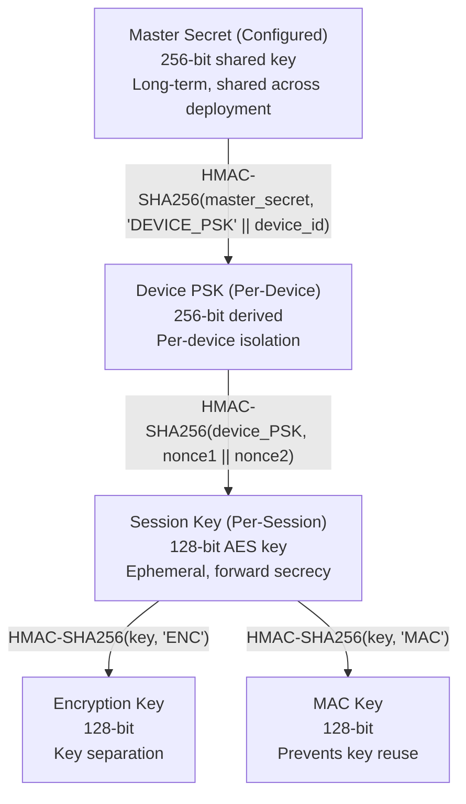
```mermaid
graph TD
    A["Master Secret (Configured)<br/>256-bit shared key<br/>Long-term, shared across deployment"]
    B["Device PSK (Per-Device)<br/>256-bit derived<br/>Per-device isolation"]
    C["Session Key (Per-Session)<br/>128-bit AES key<br/>Ephemeral, forward secrecy"]
    D["Encryption Key<br/>128-bit<br/>Key separation"]
    E["MAC Key<br/>128-bit<br/>Prevents key reuse"]
    
    A -->|"HMAC-SHA256(master_secret, 'DEVICE_PSK' || device_id)"| B
    B -->|"HMAC-SHA256(device_PSK, nonce1 || nonce2)"| C
    C -->|"HMAC-SHA256(key, 'ENC')"| D
    C -->|"HMAC-SHA256(key, 'MAC')"| E
```

#### Level 1: Master Secret
- **Purpose**: Root of trust for the entire deployment
- **Storage**: Configured on router and all client devices
- **Usage**: Only used to derive device PSKs, never used directly for encryption
- **Rotation**: Rarely changed (requires reconfiguration of all devices)

#### Level 2: Device PSK
- **Purpose**: Isolate cryptographic material per device
- **Derivation**: `Device_PSK = HMAC-SHA256(Master_Secret, "DEVICE_PSK" || device_id)`
- **Properties**: 
  - Unique per device
  - Compromise of one device doesn't expose other devices
  - Cannot be derived backward to master secret
- **Storage**: Computed on-demand during handshake, not persisted

#### Level 3: Session Key
- **Purpose**: Ephemeral key for encrypting session traffic
- **Derivation**: `Session_Key = HMAC-SHA256(Device_PSK, nonce1 || nonce2)[0:16]`
- **Properties**:
  - Fresh for every session
  - Forward secrecy: old sessions cannot be decrypted even if device PSK is compromised
  - Derived from two nonces (client and router contribution)
- **Lifetime**: Valid until session expires (1 hour) or device disconnects

#### Level 4: Encryption and MAC Keys
- **Purpose**: Separate keys for encryption and authentication
- **Derivation**: 
  - `Encryption_Key = HMAC-SHA256(Session_Key, "ENC")[0:16]`
  - `MAC_Key = HMAC-SHA256(Session_Key, "MAC")[0:16]`
- **Rationale**: Key separation prevents attacks that exploit algorithm interactions

### 4.3 AES-128-GCM Authenticated Encryption

The protocol uses AES-128 in Galois/Counter Mode (GCM) for authenticated encryption of DATA packets.

#### GCM Overview
- **Mode**: AEAD (Authenticated Encryption with Associated Data)
- **Provides**: Confidentiality + Authenticity + Integrity in one operation
- **Advantages**:
  - Single-pass operation (efficient)
  - Parallelizable
  - Authentication tag protects against tampering
  - AAD support for authenticated but unencrypted header data

#### Encryption Format

The encrypted payload structure follows this format:

| Component | Size | Position | Description |
|-----------|------|----------|-------------|
| IV (Initialization Vector) | 12 bytes | Bytes 0-11 | Session salt + counter |
| Ciphertext | Variable | Bytes 12 to N-17 | Encrypted application data |
| GCM Tag | 16 bytes | Last 16 bytes | Authentication tag |

**IV Construction Details:**

| Component | Size | Description |
|-----------|------|-------------|
| Session Salt | 4 bytes | Random value generated once per session |
| Counter | 8 bytes | 64-bit monotonic counter (big-endian) |

**IV Construction (Prevents IV Reuse):**
```c
IV = session_salt (4 bytes) || counter (8 bytes, big-endian)

- session_salt: Random 32-bit value generated once per session
- counter: 64-bit monotonic counter, incremented for each encryption
```

**Security Properties:**
- **IV Uniqueness**: Guaranteed by monotonic counter (2^64 packets per session)
- **IV Collision Resistance**: session_salt provides additional entropy
- **Overflow Protection**: Counter overflow triggers session rekey
- **No IV Reuse**: Critical for GCM security (IV reuse breaks authentication)

#### Additional Authenticated Data (AAD)

AAD allows certain packet header fields to be authenticated but not encrypted:

```c
AAD Construction for DATA packets:
AAD = source_addr (2 bytes) || dest_addr (2 bytes) || sequence_number (2 bytes)
```

**Rationale:**
- Router needs to see addresses for routing decisions
- Sequence number required for replay protection
- AAD ensures these fields cannot be tampered with
- Modification of AAD causes GCM authentication failure

#### Encryption Process

```
1. Generate IV: session_salt || counter++
2. Check counter overflow (force rekey if counter == 2^64)
3. Build AAD from packet header
4. Encrypt plaintext with AES-128-GCM:
   - Algorithm: AES-128-GCM
   - Key: encryption_key (derived from session key)
   - IV: 12 bytes (as constructed above)
   - AAD: packet header fields
   - Plaintext: application data
5. Output: IV || ciphertext || GCM_tag
6. Insert output into packet payload
7. Set FLAG_ENCRYPTED in packet header
```

#### Decryption Process

```
1. Extract IV (first 12 bytes of payload)
2. Extract GCM tag (last 16 bytes of payload)
3. Extract ciphertext (between IV and tag)
4. Reconstruct AAD from packet header
5. Attempt GCM decryption:
   - Verify GCM tag FIRST (authentication)
   - If tag valid, decrypt ciphertext
   - If tag invalid, reject packet (possible tampering)
6. Return plaintext or throw authentication error
```

### 4.4 Session Key Rotation (Rekeying)

To provide forward secrecy and limit the exposure window, sessions can be rekeyed.

#### Rekey Trigger Conditions
1. **IV Counter Near Overflow**: Approaching 2^64 encryptions
2. **Time-Based**: After extended session duration (optional)
3. **Manual Request**: Administrative rekey command

#### Rekey Protocol

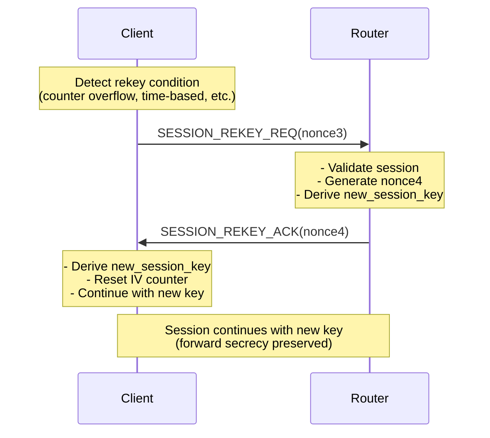
```mermaid
sequenceDiagram
    participant C as Client
    participant R as Router
    
    Note over C: Detect rekey condition<br/>(counter overflow, time-based, etc.)
    
    C->>R: SESSION_REKEY_REQ(nonce3)
    Note over R: - Validate session<br/>- Generate nonce4<br/>- Derive new_session_key
    
    R->>C: SESSION_REKEY_ACK(nonce4)
    Note over C: - Derive new_session_key<br/>- Reset IV counter<br/>- Continue with new key
    
    Note over C,R: Session continues with new key<br/>(forward secrecy preserved)
```

#### Rekey Key Derivation

```
New_Session_Key = HMAC-SHA256(Old_Session_Key, nonce3 || nonce4)[0:16]
```

**Properties:**
- Old session key contributes to new key (prevents rollback)
- Fresh nonces from both parties (mutual contribution)
- Old encrypted data cannot be decrypted with new key (forward secrecy)
- IV counter reset to zero for new session

### 4.5 Protection Against Cryptographic Attacks

#### Timing Attacks
- **Mitigation**: Constant-time comparison for HMAC verification using `CRYPTO_memcmp()` or `mbedtls_ssl_safer_memcmp()`
- **Rationale**: Prevents attackers from inferring secret values through timing side channels

#### IV Reuse Attacks (GCM)
- **Mitigation**: Counter-based IV generation with session salt
- **Guarantee**: IV is unique for every encryption operation
- **Detection**: Counter overflow triggers forced rekey

#### Replay Attacks
- **Mitigation**: See Section 6 (Sequence numbers, timestamp validation, nonce tracking)
- **Layers**: Multiple replay protection mechanisms at different protocol levels

#### Key Reuse Attacks
- **Mitigation**: Key separation (encryption key ≠ MAC key)
- **Derivation**: Independent HMAC derivations with different context strings ("ENC", "MAC")

#### Padding Oracle Attacks
- **Not Applicable**: GCM mode doesn't use padding (stream cipher mode)
- **Additional Protection**: GCM authentication prevents ciphertext manipulation

#### Birthday Attacks (Nonce Collision)
- **Mitigation**: 16-byte (128-bit) nonces provide 2^64 collision resistance
- **Tracking**: Recent nonces tracked to detect reuse attempts
- **Window**: 5-minute nonce history prevents delayed replay

### 4.6 Cryptographic Implementation Details

#### ESP32 Client (mbedTLS)
```c
- Library: mbedTLS (ARM Mbed TLS)
- Hardware: ESP32 hardware crypto acceleration
- RNG: esp_random() (hardware TRNG)
- AES-GCM: mbedtls_gcm_context
- HMAC: mbedtls_md_context with MBEDTLS_MD_SHA256
```

#### Router (OpenSSL)
```cpp
- Library: OpenSSL (libcrypto)
- RNG: RAND_bytes() (OpenSSL CSPRNG)
- AES-GCM: EVP_aes_128_gcm() API
- HMAC: HMAC() with EVP_sha256()
- Constant-time compare: CRYPTO_memcmp()
```

### 4.7 Key Storage and Zeroization

- **Master Secret**: Stored in configuration (plaintext on disk)
- **Device PSK**: Computed on-demand, not persisted
- **Session Key**: Stored in memory during session, cleared on disconnect
- **Zeroization**: Keys overwritten with zeros before deallocation
- **No Key Export**: Session keys never leave the crypto module

---


## 5. Data Flow and Packet Processing

This section describes the end-to-end flow of data packets from client to router, including encryption, transmission, validation, and decryption.

### 5.1 Data Transmission Flow (Client → Router)

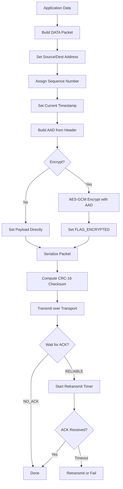
```mermaid
flowchart TD
    A[Application Data] --> B[Build DATA Packet]
    B --> C[Set Source/Dest Address]
    C --> D[Assign Sequence Number]
    D --> E[Set Current Timestamp]
    E --> F[Build AAD from Header]
    F --> G{Encrypt?}
    G -->|Yes| H[AES-GCM Encrypt with AAD]
    G -->|No| I[Set Payload Directly]
    H --> J[Set FLAG_ENCRYPTED]
    I --> K[Serialize Packet]
    J --> K
    K --> L[Compute CRC-16 Checksum]
    L --> M[Transmit over Transport]
    M --> N{Wait for ACK?}
    N -->|RELIABLE| O[Start Retransmit Timer]
    N -->|NO_ACK| P[Done]
    O --> Q{ACK Received?}
    Q -->|Yes| P
    Q -->|Timeout| R[Retransmit or Fail]
```

#### Step-by-Step Client Processing

**1. Packet Construction:**
```c
- msg_type = DATA (0x05)
- source_addr = client's assigned address
- dest_addr = router (0x0000) or target device
- sequence_number = next_seq++  // Monotonic counter
- timestamp = current_unix_time()
- ttl = DEFAULT_TTL (16)
- priority_flags = PRIORITY_NORMAL | QoS flags
- payload = application data
```

**2. Encryption (if session established):**
```c
// Build AAD (authenticated but not encrypted)
AAD = source_addr || dest_addr || sequence_number

// Generate IV (prevents IV reuse)
IV = session_salt || iv_counter++

// Encrypt with AES-128-GCM
ciphertext = AES_GCM_Encrypt(
    key: encryption_key,
    iv: IV,
    aad: AAD,
    plaintext: payload
)

// Output: IV || ciphertext || GCM_tag
encrypted_payload = IV (12 bytes) || ciphertext || tag (16 bytes)
packet.payload = encrypted_payload
packet.flags |= FLAG_ENCRYPTED
```

**3. Serialization:**
```c
// Serialize to wire format (big-endian)
buffer[0] = version_flags
buffer[1] = msg_type
buffer[2:3] = source_addr (big-endian)
buffer[4:5] = dest_addr (big-endian)
buffer[6] = payload_length
buffer[7:8] = 0x0000  // Placeholder for checksum
buffer[9:10] = sequence_number (big-endian)
... (remaining header fields) ...
buffer[19:19+len] = payload

// Compute CRC-16 over entire packet (excluding checksum field)
checksum = CRC16_CCITT(buffer)
buffer[7:8] = checksum
```

**4. Transmission:**
- Send serialized packet over active transport (WiFi or BLE)
- If RELIABLE QoS, start retransmission timer
- If NO_ACK QoS, consider sent

### 5.2 Data Reception Flow (Router Processing)

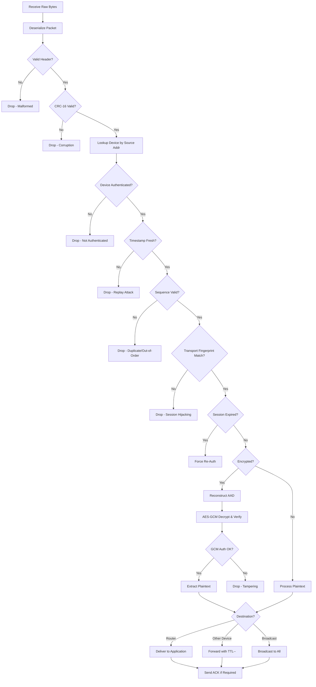
```mermaid
flowchart TD
    A[Receive Raw Bytes] --> B[Deserialize Packet]
    B --> C{Valid Header?}
    C -->|No| D[Drop - Malformed]
    C -->|Yes| E{CRC-16 Valid?}
    E -->|No| F[Drop - Corruption]
    E -->|Yes| G[Lookup Device by Source Addr]
    G --> H{Device Authenticated?}
    H -->|No| I[Drop - Not Authenticated]
    H -->|Yes| J{Timestamp Fresh?}
    J -->|No| K[Drop - Replay Attack]
    J -->|Yes| L{Sequence Valid?}
    L -->|No| M[Drop - Duplicate/Out-of-Order]
    L -->|Yes| N{Transport Fingerprint Match?}
    N -->|No| O[Drop - Session Hijacking]
    N -->|Yes| P{Session Expired?}
    P -->|Yes| Q[Force Re-Auth]
    P -->|No| R{Encrypted?}
    R -->|No| S[Process Plaintext]
    R -->|Yes| T[Reconstruct AAD]
    T --> U[AES-GCM Decrypt & Verify]
    U --> V{GCM Auth OK?}
    V -->|No| W[Drop - Tampering]
    V -->|Yes| X[Extract Plaintext]
    X --> Y{Destination?}
    S --> Y
    Y -->|Router| Z[Deliver to Application]
    Y -->|Other Device| AA[Forward with TTL--]
    Y -->|Broadcast| AB[Broadcast to All]
    Z --> AC[Send ACK if Required]
    AA --> AC
    AB --> AC
```

#### Step-by-Step Router Processing

**1. Deserialization & Basic Validation:**
```cpp
// Parse header fields from wire format
packet = ProtocolPacket::from_bytes(buffer, length);

// Validate basic structure
if (packet->get_payload().size() > MAX_PAYLOAD_SIZE) {
    drop("Payload too large");
}

// Verify CRC-16 checksum
computed_crc = compute_checksum(buffer);
if (computed_crc != packet->get_checksum()) {
    drop("Checksum mismatch - transport error");
}
```

**2. Device Lookup & State Validation:**
```cpp
device = find_device_by_address(packet->get_source_addr());
if (!device) {
    drop("Unknown source address");
}

if (device->state != ACTIVE && device->state != AUTHENTICATED) {
    drop("Device not in valid state");
}
```

**3. Security Validations:**

**a) Session Expiration Check:**
```cpp
if (device->is_session_expired()) {
    // Force re-authentication after 1 hour
    device->state = CONNECTING;
    device->session_crypto.reset();
    send_error(device, SESSION_EXPIRED);
    return;
}
```

**b) Timestamp Freshness (Replay Protection):**
```cpp
const uint32_t MAX_TIMESTAMP_AGE = 60;  // seconds

current_time = get_current_unix_time();
packet_time = packet->get_timestamp();

if (current_time - packet_time > MAX_TIMESTAMP_AGE) {
    send_error(device, STALE_TIMESTAMP);
    drop("Packet too old - possible replay attack");
}
```

**c) Sequence Number Validation (Replay Protection):**
```cpp
// Sliding window: track recent sequence numbers
if (!device->sequence_window.is_valid(packet->get_sequence_number())) {
    send_error(device, INVALID_SEQUENCE);
    drop("Duplicate or out-of-window sequence number");
}

// Accept sequence number
device->sequence_window.accept(packet->get_sequence_number());
```

**d) Transport Fingerprint (Session Hijacking Protection):**
```cpp
// Verify transport fingerprint hasn't changed
if (device->fingerprint != current_transport_fingerprint) {
    drop("Transport fingerprint mismatch - possible hijacking");
}
```

**4. Decryption (if encrypted):**
```cpp
if (packet->is_encrypted()) {
    // Reconstruct AAD from packet header
    AAD = build_aad(packet->get_source_addr(),
                    packet->get_dest_addr(),
                    packet->get_sequence_number());
    
    try {
        // Decrypt with GCM (includes authentication tag verification)
        plaintext = device->session_crypto->decrypt_gcm(
            ciphertext: packet->get_payload(),
            aad: AAD
        );
        
        packet->set_payload(plaintext);
        packet->set_encrypted(false);
    }
    catch (GCMAuthenticationFailure) {
        send_error(device, DECRYPTION_FAILED);
        drop("GCM authentication failed - possible tampering");
    }
}
```

**5. Routing Decision:**
```cpp
dest_addr = packet->get_dest_addr();

if (dest_addr == ROUTER_ADDRESS) {
    // Packet for router - deliver to application
    dispatch_to_application(packet);
}
else if (dest_addr == BROADCAST_ADDRESS) {
    // Broadcast to all devices
    broadcast_to_all_devices(packet);
}
else {
    // Forward to target device
    if (packet->get_ttl() == 0) {
        drop("TTL expired");
    }
    packet->decrement_ttl();
    forward_to_device(dest_addr, packet);
}
```

**6. Acknowledgment (if required):**
```cpp
if (packet->get_priority_flags() & FLAG_QOS_RELIABLE) {
    // Send ACK packet
    ack_packet = build_ack_packet(
        source: ROUTER_ADDRESS,
        dest: packet->get_source_addr(),
        ack_seq: packet->get_sequence_number()
    );
    send_packet(ack_packet);
}
```

### 5.3 Packet Validation Summary

| Validation | Purpose | Action on Failure |
|------------|---------|-------------------|
| CRC-16 Checksum | Detect transport errors | Drop silently |
| Header Structure | Malformed packet detection | Drop silently |
| Source Address | Device lookup | Drop silently |
| Device State | Ensure authenticated | Drop, log warning |
| Session Expiration | Force periodic re-auth | Send ERROR, force re-auth |
| Timestamp Freshness | Replay attack prevention | Send ERROR, drop |
| Sequence Number | Duplicate/replay detection | Send ERROR, drop |
| Transport Fingerprint | Session hijacking prevention | Drop, log security event |
| GCM Authentication | Integrity & authenticity | Send ERROR, drop |

### 5.4 Performance Optimizations

- **Zero-Copy Processing**: Payload buffers reused without copying when possible
- **Early Rejection**: Invalid packets dropped before expensive crypto operations
- **Parallel Validation**: Independent checks (timestamp, sequence) performed in parallel
- **Crypto Acceleration**: Hardware AES-GCM on ESP32, OpenSSL optimizations on router

---

## 6. Security Mechanisms - Replay Attack Prevention

Replay attacks involve an attacker capturing legitimate packets and retransmitting them later to gain unauthorized access or disrupt communication. MITA employs multiple layered defenses against replay attacks.

### 6.1 Timestamp-Based Freshness Validation

**Mechanism:**
- Each DATA packet includes a 32-bit timestamp field in header (milliseconds since boot)
- Router validates timestamp is within acceptable window (60 seconds = 60,000 ms)
- Uses **relative time** (millis()) instead of absolute Unix time
- **No RTC Required** - works without real-time clock
- Handles 32-bit wrap-around (occurs every ~49 days)

**Implementation:**
```cpp
bool validate_packet_timestamp(uint32_t timestamp) {
    const uint32_t MAX_PACKET_AGE_MS = 60000;  // 60 seconds
    
    // Get current milliseconds since boot
    uint32_t current_time = millis();
    
    // Calculate age with wrap-around handling
    uint32_t age;
    if (current_time >= timestamp) {
        age = current_time - timestamp;
    } else {
        // Wrapped around (timestamp is from before the wrap)
        age = (UINT32_MAX - timestamp) + current_time + 1;
    }
    
    // Reject extremely old packets (>60 seconds)
    if (age > MAX_PACKET_AGE_MS) {
        send_error(STALE_TIMESTAMP);
        return false;
    }
    
    return true;
}
```

**Properties:**
- **Replay Window**: Old packets (>60s) automatically rejected
- **No Clock Sync Needed**: Uses relative device uptime, not absolute time
- **Wrap-Around Safe**: Handles 32-bit counter overflow correctly
- **Tolerant**: 60-second window accommodates network delays
- **Attack Mitigation**: Prevents long-term replay attacks

**Advantages over Unix Timestamps:**
- Works on embedded devices without RTC (real-time clock)
- No time synchronization overhead (NTP, SNTP)
- No vulnerability to time-sync attacks
- Simpler implementation on constrained devices

**Limitations:**
- Still vulnerable to replay within 60-second window (mitigated by sequence numbers)
- Long device downtime (>49 days) causes timestamp wrap-around (handled automatically)

### 6.2 Sequence Number Sliding Window

**Mechanism:**
- 16-bit monotonically increasing sequence counter per device
- Router tracks recent sequence numbers using sliding window
- Window size: 64 packets (configurable)

**Sliding Window Implementation:**
```
Current Sequence: 150
Window: [87, 88, ..., 150]
         └─────┬─────┘
            64 slots

Accept: seq > 150 or (seq >= 87 and not seen)
Reject: seq < 87 or already received
```

**Processing Logic:**
```cpp
struct SequenceWindow {
    uint16_t highest_seq_seen;
    uint64_t received_bitmap;  // Bitmap of last 64 sequences
    const size_t WINDOW_SIZE = 64;
    
    bool is_valid(uint16_t seq) {
        if (seq > highest_seq_seen) {
            return true;  // Future sequence, accept
        }
        
        uint16_t delta = highest_seq_seen - seq;
        if (delta >= WINDOW_SIZE) {
            return false;  // Too old, outside window
        }
        
        // Check if already received
        uint64_t mask = 1ULL << delta;
        return (received_bitmap & mask) == 0;
    }
    
    void accept(uint16_t seq) {
        if (seq > highest_seq_seen) {
            // Shift window forward
            uint16_t shift = seq - highest_seq_seen;
            received_bitmap <<= shift;
            highest_seq_seen = seq;
        }
        
        // Mark as received
        uint16_t delta = highest_seq_seen - seq;
        received_bitmap |= (1ULL << delta);
    }
};
```

**Properties:**
- **Duplicate Detection**: Each sequence accepted only once
- **Out-of-Order Support**: Packets can arrive out of order (within window)
- **Wrap-Around Handling**: 16-bit counter wraps at 65536 (automatically handled)
- **Memory Efficient**: 64-bit bitmap for 64-packet window

**Attack Mitigation:**
- Prevents duplicate packet replay
- Prevents replay of old packets
- Limits replay to very recent packets (within 64-packet window)

### 6.3 Nonce Tracking (Handshake)

**Mechanism:**
- Track recent nonces used in HELLO messages
- Reject handshakes with reused nonces
- History size: 100 recent nonces
- Expiry: 5 minutes

**Implementation:**
```cpp
struct NonceRecord {
    vector<uint8_t> nonce;
    time_point timestamp;
};

deque<NonceRecord> recent_nonces;  // Last 100 nonces
const seconds NONCE_EXPIRY{300};   // 5 minutes

bool is_nonce_reused(const vector<uint8_t>& nonce) {
    // Remove expired nonces
    auto now = steady_clock::now();
    while (!recent_nonces.empty()) {
        if (now - recent_nonces.front().timestamp > NONCE_EXPIRY) {
            recent_nonces.pop_front();
        } else {
            break;
        }
    }
    
    // Check for reuse
    for (const auto& record : recent_nonces) {
        if (record.nonce == nonce) {
            return true;  // Reused!
        }
    }
    return false;
}
```

**Properties:**
- **Handshake Protection**: Prevents replay of HELLO messages
- **Memory Bounded**: Limited to 100 recent nonces
- **Time-Limited**: Old nonces (>5min) automatically expire

### 6.4 Handshake Freshness Window

**Mechanism:**
- CHALLENGE packet includes timestamp
- AUTH must arrive within 10 seconds of CHALLENGE
- Handshake state stored with creation time

**Validation:**
```cpp
const uint64_t MAX_HANDSHAKE_AGE_MS = 10000;  // 10 seconds

HandshakeState& state = pending_handshakes[device_id];
uint64_t age = current_time_ms - state.creation_time_ms;

if (age > MAX_HANDSHAKE_AGE_MS) {
    reject_auth("Handshake expired");
    remove_handshake(device_id);
}
```

**Properties:**
- **Tight Window**: Only 10 seconds to complete handshake
- **Reduces Exposure**: Limits time window for replay attacks
- **Cleanup**: Expired handshakes automatically removed

### 6.5 Combined Defense Strategy

```
Packet Reception Timeline:

T=0: Packet Captured by Attacker
│
├─> T+5s: Replay Attempt #1
│   └─> BLOCKED: Sequence number already seen
│
├─> T+30s: Replay Attempt #2 with modified sequence
│   └─> BLOCKED: Timestamp too old (>60s threshold approaching)
│
├─> T+70s: Replay Attempt #3
│   └─> BLOCKED: Timestamp stale (>60s)
│
└─> T+1hr: Replay Attempt #4 (new session)
    └─> BLOCKED: Session expired, GCM decryption fails (different session key)
```

**Layered Protection:**
1. **First Line**: Sequence number validation (immediate duplicates)
2. **Second Line**: Timestamp freshness (time-based replay)
3. **Third Line**: GCM authentication (wrong session/key)
4. **Fourth Line**: Nonce tracking (handshake replay)

---

## 7. Security Mechanisms - DoS Prevention

Denial of Service (DoS) attacks attempt to exhaust router resources by flooding with packets. MITA implements multiple rate limiting and resource management strategies.

### 7.1 Per-Device Handshake Rate Limiting

**Configuration:**
```cpp
struct RateLimitState {
    deque<time_point> attempts;
    size_t max_attempts = 3;      // Max 3 handshakes
    seconds window{60};           // Per 60 seconds
};
```

**Enforcement:**
```cpp
bool check_rate_limit(const string& device_id) {
    auto& state = rate_limits[device_id];
    auto now = steady_clock::now();
    
    // Remove old attempts outside window
    while (!state.attempts.empty() &&
           now - state.attempts.front() > state.window) {
        state.attempts.pop_front();
    }
    
    // Check limit
    if (state.attempts.size() >= state.max_attempts) {
        log_warning("Rate limit exceeded", device_id);
        return false;  // Deny
    }
    
    // Allow and record
    state.attempts.push_back(now);
    return true;
}
```

**Properties:**
- **Per-Device**: Isolated limits prevent one device from affecting others
- **Sliding Window**: Rolling 60-second window
- **Conservative**: Max 3 attempts per minute (reduced from 5 for stricter security)

### 7.2 Global Handshake Rate Limiting

**Configuration:**
```cpp
deque<time_point> global_handshake_attempts;
size_t global_max_attempts = 50;   // Max 50 total handshakes
seconds global_window{60};          // Per 60 seconds
```

**Purpose:**
- Prevents distributed DoS from multiple devices/attackers
- Protects router CPU and memory during attack
- Global limit across all devices

**Enforcement:**
- Same sliding window mechanism as per-device
- Checked before per-device limit
- Failure logged as security event

### 7.3 Heartbeat Flood Protection

**Configuration:**
```cpp
struct ManagedDevice {
    time_point last_heartbeat_time;
    size_t heartbeat_count = 0;
    const size_t MAX_HEARTBEATS_PER_WINDOW = 120;  // Max 120 heartbeats
    const seconds HEARTBEAT_WINDOW{60};             // Per 60 seconds
};
```

**Enforcement:**
```cpp
void process_heartbeat(const string& device_id) {
    auto* device = find_device(device_id);
    auto now = steady_clock::now();
    
    // Reset counter if window expired
    if (now - device->last_heartbeat_time >= HEARTBEAT_WINDOW) {
        device->heartbeat_count = 0;
        device->last_heartbeat_time = now;
    }
    
    device->heartbeat_count++;
    
    // Check flood
    if (device->heartbeat_count > MAX_HEARTBEATS_PER_WINDOW) {
        log_warning("Heartbeat flood detected", device_id);
        drop_packet();  // Silently drop excessive heartbeats
        return;
    }
    
    // Process normal heartbeat
    update_device_activity(device_id);
}
```

**Properties:**
- **Limit**: Max 120 heartbeats per minute (2 per second on average)
- **Silent Drop**: Excessive heartbeats dropped without error response
- **No Punishment**: Device not disconnected, just rate-limited

### 7.4 Connection Limits

**Configuration:**
```cpp
const size_t MAX_DEVICES_TOTAL = 1000;      // System-wide limit
const size_t MAX_DEVICES_PER_TRANSPORT = 500;  // Per WiFi/BLE
```

**Enforcement:**
- New device registrations rejected when limit reached
- Prevents memory exhaustion
- Graceful degradation (ERROR response sent)

### 7.5 Packet Size Validation

**Enforcement:**
```cpp
const size_t MAX_PAYLOAD_SIZE = 256;
const size_t MAX_PACKET_SIZE = HEADER_SIZE + MAX_PAYLOAD_SIZE;

if (packet.payload_length > MAX_PAYLOAD_SIZE) {
    drop_packet("Oversized payload");
}

if (total_packet_size > MAX_PACKET_SIZE) {
    drop_packet("Oversized packet");
}
```

**Properties:**
- Prevents memory exhaustion from huge packets
- Early validation before allocation
- Consistent limits across transports

### 7.6 Resource Cleanup

**Inactive Device Cleanup:**
```cpp
void cleanup_inactive_devices(seconds timeout = 300s) {
    auto cutoff = steady_clock::now() - timeout;
    
    for (auto& [device_id, device] : managed_devices) {
        if (device.last_activity < cutoff) {
            remove_device(device_id);  // Free resources
        }
    }
}
```

**Expired Handshake Cleanup:**
```cpp
void cleanup_expired_handshakes(seconds timeout = 30s) {
    auto cutoff = steady_clock::now() - timeout;
    
    for (auto it = pending_handshakes.begin(); 
         it != pending_handshakes.end(); ) {
        if (it->second.timestamp < cutoff) {
            it = pending_handshakes.erase(it);
        } else {
            ++it;
        }
    }
}
```

**Properties:**
- **Periodic Cleanup**: Runs every 60 seconds
- **Memory Management**: Frees stale state
- **Attack Recovery**: Removes zombie connections from failed attacks

---

## 8. Security Mechanisms - Transport Fingerprinting

Transport fingerprinting prevents session hijacking by validating that all packets in a session come from the same physical connection.

### 8.1 Fingerprint Types

#### WiFi Transport Fingerprint
- **Source**: TCP socket address (IP + port)
- **Format**: `"<IP>:<port>"` (e.g., "192.168.1.100:54321")
- **Stability**: Stable for duration of TCP connection
- **Change Trigger**: Socket disconnect/reconnect

#### BLE Transport Fingerprint
- **Source**: BLE device MAC address
- **Format**: `"<MAC>"` (e.g., "AA:BB:CC:DD:EE:FF")
- **Stability**: Permanent (device hardware address)
- **Change Trigger**: Never changes (unless MAC randomization enabled)

### 8.2 Fingerprint Lifecycle

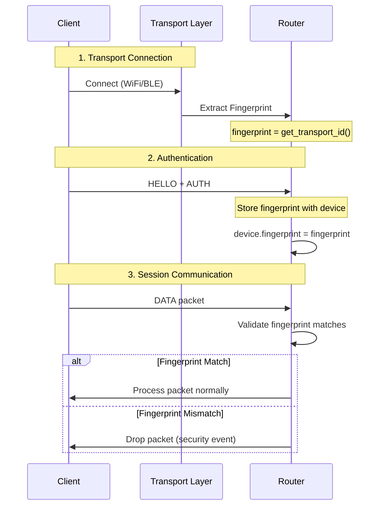
```mermaid
sequenceDiagram
    participant C as Client
    participant T as Transport Layer
    participant R as Router
    
    Note over C,T: 1. Transport Connection
    C->>T: Connect (WiFi/BLE)
    T->>R: Extract Fingerprint
    Note over R: fingerprint = get_transport_id()
    
    Note over C,R: 2. Authentication
    C->>R: HELLO + AUTH
    Note over R: Store fingerprint with device
    R->>R: device.fingerprint = fingerprint
    
    Note over C,R: 3. Session Communication
    C->>R: DATA packet
    R->>R: Validate fingerprint matches
    alt Fingerprint Match
        R->>C: Process packet normally
    else Fingerprint Mismatch
        R->>C: Drop packet (security event)
    end
```

### 8.3 Fingerprint Validation

**Storage:**
```cpp
struct ManagedDevice {
    string device_id;
    string fingerprint;  // Stored during authentication
    TransportType transport_type;
    // ... other fields
};
```

**Validation Logic:**
```cpp
void handle_packet(const string& device_id,
                  const ProtocolPacket& packet,
                  TransportType transport,
                  const string& current_fingerprint) {
    
    // Skip validation for HELLO (no fingerprint yet)
    if (packet.get_message_type() == MessageType::HELLO) {
        return;
    }
    
    auto* device = find_device(device_id);
    if (!device) return;
    
    // Validate fingerprint
    if (!device->fingerprint.empty() && 
        device->fingerprint != current_fingerprint) {
        
        log_security_event("Transport fingerprint mismatch",
                          device_id,
                          device->fingerprint,
                          current_fingerprint);
        
        drop_packet("Session hijacking suspected");
        return;
    }
    
    // First packet or fingerprint matches - proceed
    if (device->fingerprint.empty()) {
        device->fingerprint = current_fingerprint;
    }
    
    process_packet(packet);
}
```

### 8.4 Attack Scenarios Prevented

#### Scenario 1: WiFi Session Hijacking
```
Legitimate Client: 192.168.1.100:5000 (authenticated)
Attacker:          192.168.1.200:6000 (different IP)

Attacker sends packet with stolen session key:
- Source address: Legitimate client's assigned address
- Encrypted with valid session key (somehow obtained)

Router validation:
1. Packet decrypts successfully (valid key)
2. Fingerprint check: "192.168.1.200:6000" ≠ "192.168.1.100:5000"
3. BLOCKED: Fingerprint mismatch
```

#### Scenario 2: BLE Impersonation
```
Legitimate Device: MAC AA:BB:CC:DD:EE:FF (authenticated)
Attacker Device:   MAC 11:22:33:44:55:66 (different MAC)

Attacker spoofs BLE packets:
- Claims to be legitimate device
- Encrypted with stolen session key

Router validation:
1. Packet arrives over BLE connection from attacker MAC
2. Fingerprint check: "11:22:33:44:55:66" ≠ "AA:BB:CC:DD:EE:FF"
3. BLOCKED: Fingerprint mismatch
```

### 8.5 Limitations and Considerations

**Limitations:**
- **IP Changes**: WiFi client with dynamic IP change appears as new device
- **MAC Randomization**: iOS/Android may randomize BLE MAC (mitigated by device_id)
- **NAT**: Multiple devices behind NAT share public IP (WiFi transport)

**Mitigations:**
- **Device ID**: Primary identity, fingerprint is secondary check
- **Graceful Reconnect**: Client can reconnect with new fingerprint (requires re-auth)
- **BLE Preferred**: BLE MAC more stable than WiFi socket

**Security Trade-offs:**
- **False Positives**: Legitimate reconnects may be blocked (requires re-authentication)
- **Usability vs Security**: Strict validation improves security but may impact mobile clients

---

## 9. Session Management

Sessions represent the authenticated communication channel between client and router. Proper session management ensures security and resource efficiency.

### 9.1 Session Lifecycle

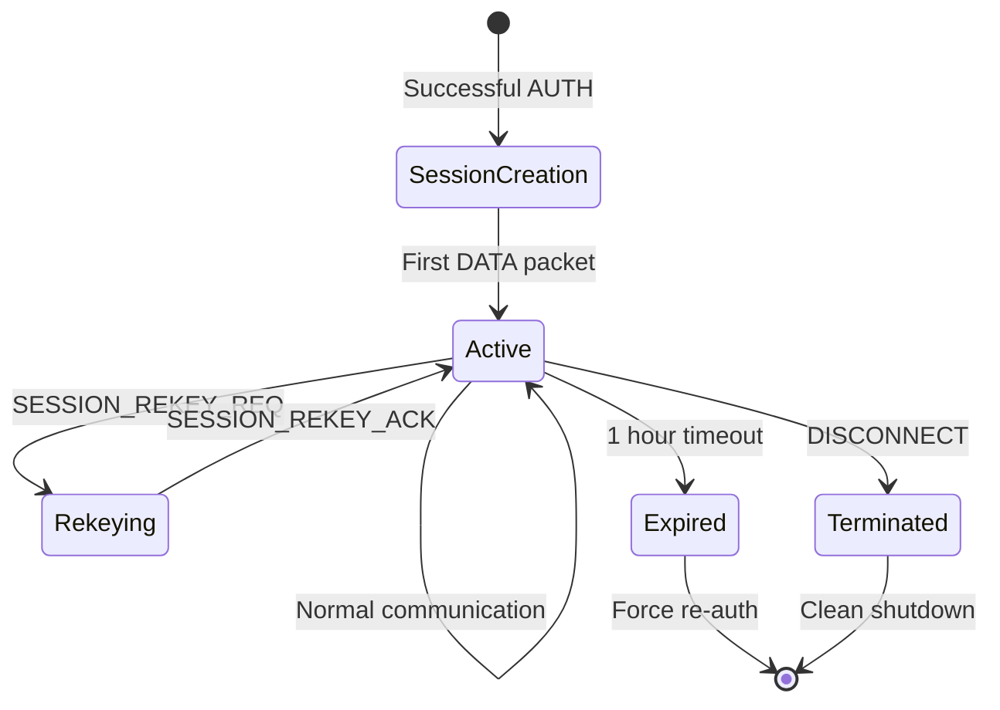
```mermaid
stateDiagram-v2
    [*] --> SessionCreation: Successful AUTH
    SessionCreation --> Active: First DATA packet
    Active --> Active: Normal communication
    Active --> Rekeying: SESSION_REKEY_REQ
    Rekeying --> Active: SESSION_REKEY_ACK
    Active --> Expired: 1 hour timeout
    Active --> Terminated: DISCONNECT
    Expired --> [*]: Force re-auth
    Terminated --> [*]: Clean shutdown
```

### 9.2 Session Creation

**Triggered by:** Successful AUTH_ACK completion

**Session Creation Flow:**


```mermaid
flowchart TD
    A[AUTH_ACK Received] --> B[Derive Session Key]
    B --> C[HMAC-SHA256<br>device_PSK, nonce1 &#124;&#124; nonce2<br>Take first 16 bytes]

    C --> D[Create Crypto Context]
    D --> E[Initialize Session Metadata]
    
    E --> F[Set session_created timestamp]
    F --> G[Calculate session_expires<br>created + 1 hour]
    
    G --> H[Reset Sequence Tracking]
    H --> I[sequence_window.reset<br>sequence_initialized = false]
    
    I --> J[Store Transport Fingerprint]
    J --> K[Capture current connection details<br>IP:port or BLE MAC]
    
    K --> L[Set Device State]
    L --> M[state = AUTHENTICATED]
    
    M --> N[Session Active<br>Ready for DATA packets]
    
    style A fill:#e6f3ff
    style C fill:#ccffcc
    style M fill:#ccffcc
    style N fill:#90EE90
```

**Session Components:**

| Component | Description | Purpose |
|-----------|-------------|---------|
| **Session Key** | 128-bit AES key derived from handshake | Encryption/MAC derivation |
| **Crypto Context** | PacketCrypto instance with session key | Encrypt/decrypt operations |
| **Created Timestamp** | Session start time | Track session age |
| **Expires Timestamp** | Created + 1 hour | Enforce session lifetime |
| **Sequence Window** | Sliding window (64 packets) | Replay protection |
| **Transport Fingerprint** | Connection identifier (IP/MAC) | Session hijacking prevention |
| **Device State** | AUTHENTICATED | Enable data communication |

### 9.3 Session Expiration

**Session Lifetime Policy:**

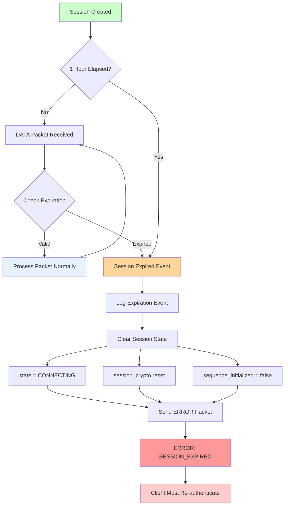
```mermaid
flowchart TD
    A[Session Created] --> B{1 Hour Elapsed?}
    
    B -->|No| C[DATA Packet Received]
    C --> D{Check Expiration}
    D -->|Valid| E[Process Packet Normally]
    E --> C
    
    D -->|Expired| F[Session Expired Event]
    B -->|Yes| F
    
    F --> G[Log Expiration Event]
    G --> H[Clear Session State]
    
    H --> I[state = CONNECTING]
    H --> J[session_crypto.reset]
    H --> K[sequence_initialized = false]
    
    I --> L[Send ERROR Packet]
    J --> L
    K --> L
    
    L --> M[ERROR: SESSION_EXPIRED]
    M --> N[Client Must Re-authenticate]
    
    style A fill:#ccffcc
    style E fill:#e6f3ff
    style F fill:#ffd699
    style M fill:#ff9999
    style N fill:#ffcccc
```

**Expiration Enforcement:**

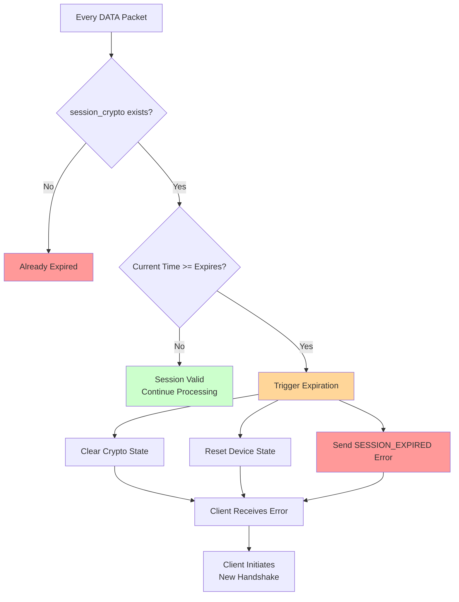
```mermaid
graph TD
    A[Every DATA Packet] --> B{session_crypto exists?}
    B -->|No| C[Already Expired]
    B -->|Yes| D{Current Time >= Expires?}
    
    D -->|No| E[Session Valid<br/>Continue Processing]
    D -->|Yes| F[Trigger Expiration]
    
    F --> G[Clear Crypto State]
    F --> H[Reset Device State]
    F --> I[Send SESSION_EXPIRED Error]
    
    G --> J[Client Receives Error]
    H --> J
    I --> J
    
    J --> K[Client Initiates<br/>New Handshake]
    
    style E fill:#ccffcc
    style F fill:#ffd699
    style C fill:#ff9999
    style I fill:#ff9999
```

**Rationale:**

| Benefit | Description |
|---------|-------------|
| **Forward Secrecy** | Limits exposure window if session key is compromised |
| **Key Rotation** | Forces periodic refresh of cryptographic material |
| **Resource Cleanup** | Removes stale sessions, frees memory |
| **Security Best Practice** | Limits lifetime of cryptographic keys (NIST recommendation) |

### 9.4 Session Rekeying

**Trigger Conditions:**
1. IV counter approaching overflow (2^64)
2. Time-based (optional policy)
3. Administrative command

**Rekey Process Flow:**

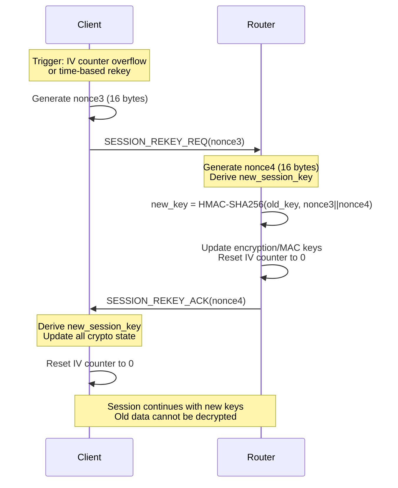
```mermaid
sequenceDiagram
    participant C as Client
    participant R as Router
    
    Note over C: Trigger: IV counter overflow<br/>or time-based rekey
    
    C->>C: Generate nonce3 (16 bytes)
    C->>R: SESSION_REKEY_REQ(nonce3)
    
    Note over R: Generate nonce4 (16 bytes)<br/>Derive new_session_key
    R->>R: new_key = HMAC-SHA256(old_key, nonce3||nonce4)
    R->>R: Update encryption/MAC keys<br/>Reset IV counter to 0
    
    R->>C: SESSION_REKEY_ACK(nonce4)
    
    Note over C: Derive new_session_key<br/>Update all crypto state
    C->>C: Reset IV counter to 0
    
    Note over C,R: Session continues with new keys<br/>Old data cannot be decrypted
```

**Key Derivation Chain:**

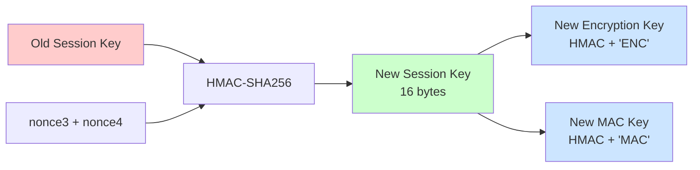
```mermaid
graph LR
    A[Old Session Key] --> B[HMAC-SHA256]
    C[nonce3 + nonce4] --> B
    B --> D[New Session Key<br/>16 bytes]
    D --> E[New Encryption Key<br/>HMAC + 'ENC']
    D --> F[New MAC Key<br/>HMAC + 'MAC']
    
    style A fill:#ffcccc
    style D fill:#ccffcc
    style E fill:#cce5ff
    style F fill:#cce5ff
```

**Security Properties:**
- **Forward Secrecy**: Old session key cannot decrypt packets encrypted with new key
- **Rollback Prevention**: New key cryptographically depends on old key
- **Mutual Contribution**: Both client and router contribute fresh randomness
- **State Reset**: IV counter reset to 0 prevents counter exhaustion

### 9.5 IV Counter Management

**Counter Overflow Protection:**

The IV counter is a critical security component that ensures each encryption operation uses a unique initialization vector.

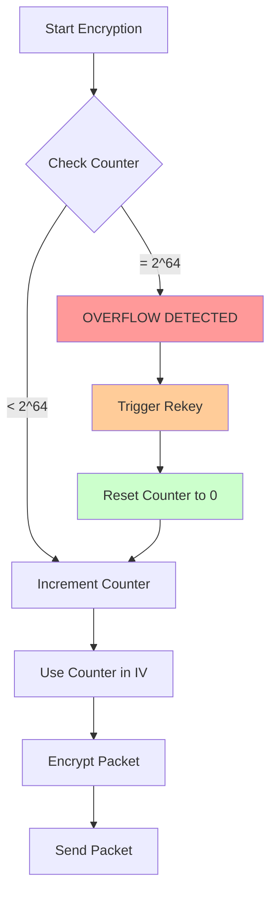
```mermaid
graph TD
    A[Start Encryption] --> B{Check Counter}
    B -->|< 2^64| C[Increment Counter]
    C --> D[Use Counter in IV]
    D --> E[Encrypt Packet]
    E --> F[Send Packet]
    
    B -->|= 2^64| G[OVERFLOW DETECTED]
    G --> H[Trigger Rekey]
    H --> I[Reset Counter to 0]
    I --> C
    
    style G fill:#ff9999
    style H fill:#ffcc99
    style I fill:#ccffcc
```

**Practical Considerations:**
- **Capacity**: 2^64 (18.4 quintillion) encryptions before overflow
- **Time to Overflow**: At 1,000 packets/second: ~584 million years
- **Detection**: Defensive programming - not expected to trigger in practice
- **Action**: Automatic rekey when approaching limit

### 9.6 Session Resumption (To be implemented)

**Planned Capability:**

Session resumption will allow clients to quickly reconnect after brief disconnections without performing a full handshake.

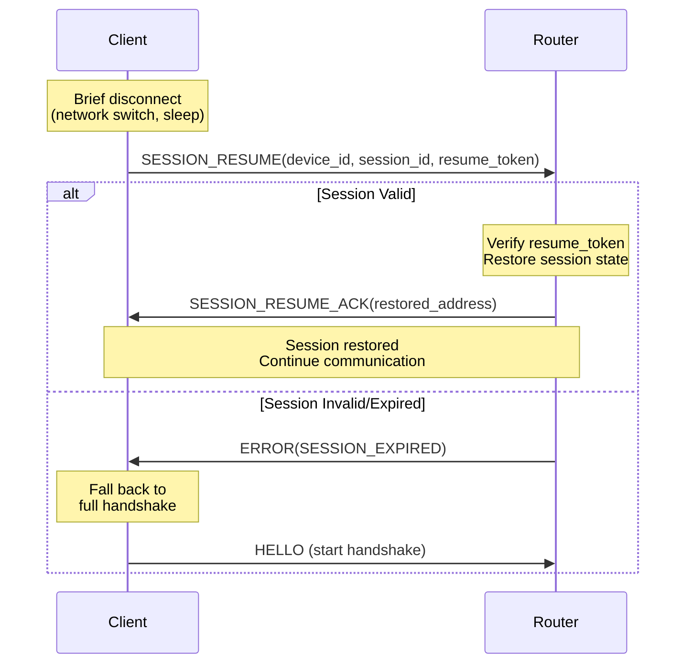
```mermaid
sequenceDiagram
    participant C as Client
    participant R as Router
    
    Note over C: Brief disconnect<br/>(network switch, sleep)
    
    C->>R: SESSION_RESUME(device_id, session_id, resume_token)
    
    alt Session Valid
        Note over R: Verify resume_token<br/>Restore session state
        R->>C: SESSION_RESUME_ACK(restored_address)
        Note over C,R: Session restored<br/>Continue communication
    else Session Invalid/Expired
        R->>C: ERROR(SESSION_EXPIRED)
        Note over C: Fall back to<br/>full handshake
        C->>R: HELLO (start handshake)
    end
```

**Benefits:**
- **Fast Reconnection**: Skip 4-way handshake overhead
- **State Preservation**: Maintain sequence numbers and session context
- **Reduced Overhead**: Lower CPU and network usage for reconnections
- **Better UX**: Seamless experience during network transitions

### 9.7 Session Cleanup

**Session Lifecycle Management:**

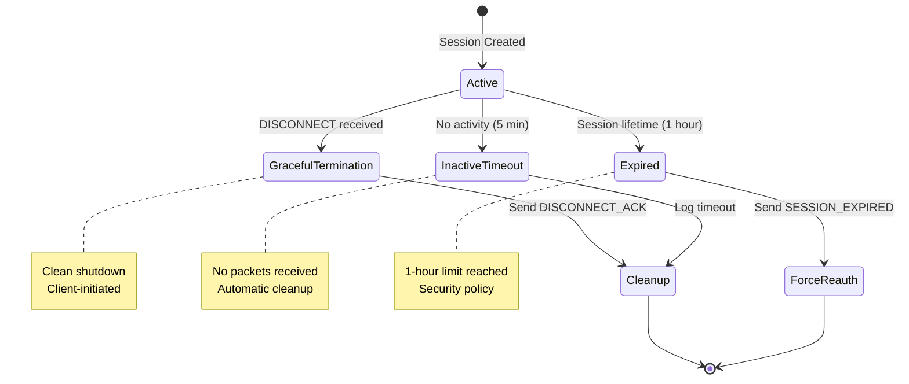
```mermaid
stateDiagram-v2
    [*] --> Active: Session Created
    Active --> GracefulTermination: DISCONNECT received
    Active --> InactiveTimeout: No activity (5 min)
    Active --> Expired: Session lifetime (1 hour)
    
    GracefulTermination --> Cleanup: Send DISCONNECT_ACK
    InactiveTimeout --> Cleanup: Log timeout
    Expired --> ForceReauth: Send SESSION_EXPIRED
    
    Cleanup --> [*]
    ForceReauth --> [*]
    
    note right of GracefulTermination
        Clean shutdown
        Client-initiated
    end note
    
    note right of InactiveTimeout
        No packets received
        Automatic cleanup
    end note
    
    note right of Expired
        1-hour limit reached
        Security policy
    end note
```

**Cleanup Triggers:**

| Trigger | Timeout | Action | Reason |
|---------|---------|--------|---------|
| Graceful Disconnect | Immediate | Send ACK, remove session | Client requested |
| Inactivity | 5 minutes | Remove session silently | Resource cleanup |
| Session Expiration | 1 hour | Force re-authentication | Security policy |
| Handshake Timeout | 30 seconds | Remove pending state | Failed handshake |

**Periodic Maintenance:**

The router performs background maintenance every 60 seconds:
- Remove inactive devices (no packets for 5+ minutes)
- Check for expired sessions and force re-authentication
- Clean up stale handshake attempts
- Update statistics and metrics

---

## 10. Quality of Service Features

MITA provides QoS mechanisms to ensure reliable delivery and priority handling of packets.

### 10.1 Priority Levels

**Four-Level Priority System:**

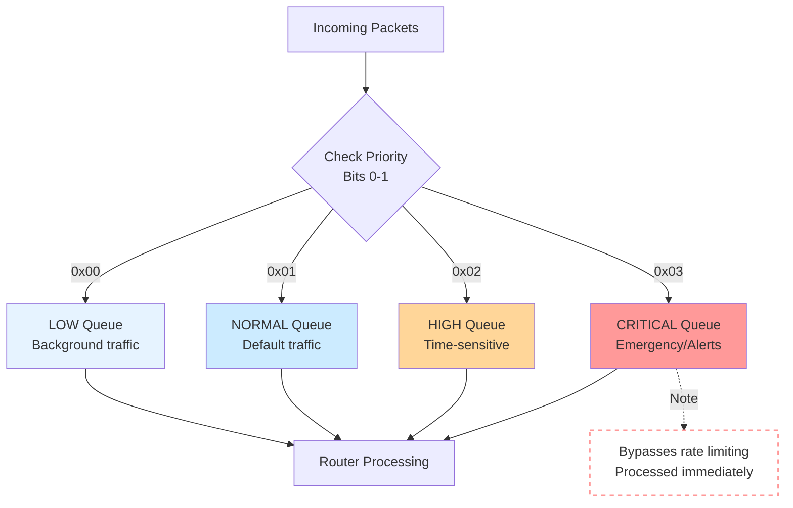
```mermaid
graph TD
    A[Incoming Packets] --> B{Check Priority<br/>Bits 0-1}
    
    B -->|0x00| C[LOW Queue<br/>Background traffic]
    B -->|0x01| D[NORMAL Queue<br/>Default traffic]
    B -->|0x02| E[HIGH Queue<br/>Time-sensitive]
    B -->|0x03| F[CRITICAL Queue<br/>Emergency/Alerts]
    
    C --> G[Router Processing]
    D --> G
    E --> G
    F --> G
    
    F -.->|Note| H[Bypasses rate limiting<br/>Processed immediately]
    
    style C fill:#e6f3ff
    style D fill:#ccebff
    style E fill:#ffd699
    style F fill:#ff9999
    style H fill:#fff,stroke:#ff9999,stroke-width:2px,stroke-dasharray: 5 5
```

**Priority Configuration:**

| Level | Value | Use Case | Router Behavior |
|-------|-------|----------|-----------------|
| LOW | 0x00 | Periodic sensor readings, bulk data | Processed when idle |
| NORMAL | 0x01 | Regular application data | Standard processing |
| HIGH | 0x02 | Commands, time-sensitive data | Prioritized in queue |
| CRITICAL | 0x03 | Alerts, emergencies, safety | Immediate processing, bypass limits |

### 10.2 QoS Modes

**Delivery Guarantees:**

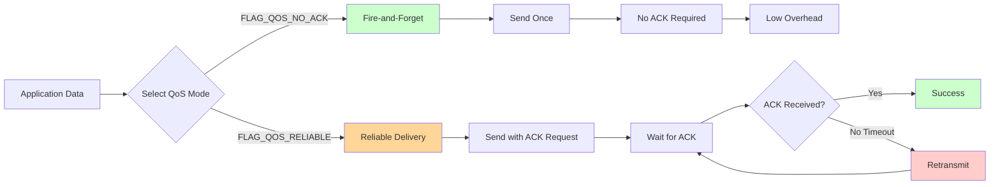
```mermaid
graph LR
    A[Application Data] --> B{Select QoS Mode}
    
    B -->|FLAG_QOS_NO_ACK| C[Fire-and-Forget]
    B -->|FLAG_QOS_RELIABLE| D[Reliable Delivery]
    
    C --> E[Send Once]
    E --> F[No ACK Required]
    F --> G[Low Overhead]
    
    D --> H[Send with ACK Request]
    H --> I[Wait for ACK]
    I --> J{ACK Received?}
    J -->|Yes| K[Success]
    J -->|No Timeout| L[Retransmit]
    L --> I
    
    style C fill:#ccffcc
    style D fill:#ffd699
    style K fill:#ccffcc
    style L fill:#ffcccc
```

**Mode Comparison:**

| Feature | Fire-and-Forget (0x10) | Reliable Delivery (0x20) |
|---------|------------------------|--------------------------|
| **Acknowledgment** | None | Required |
| **Retransmission** | No | Yes (on timeout) |
| **Overhead** | Minimal | Higher (ACK packets) |
| **Guarantee** | Best-effort | Delivery confirmed |
| **Use Cases** | Periodic telemetry, sensor data | Commands, control messages, critical data |
| **Latency** | Lower | Higher (wait for ACK) |
| **Network Load** | Lower | Higher (ACK traffic) |

### 10.3 TTL-Based Routing

**Purpose:** Prevent routing loops in mesh networks

**TTL Mechanism:**

```mermaid
graph LR
    A[Client<br/>TTL=16] -->|Hop 1| B[Router A<br/>TTL=15]
    B -->|Hop 2| C[Router B<br/>TTL=14]
    C -->|Hop 3| D[Router C<br/>TTL=13]
    D -->|Continue| E[...]
    E -->|Hop 16| F[Router N<br/>TTL=1]
    F -->|Hop 17| G[TTL=0<br/>DROPPED]
    
    G -.->|Note| H[Prevents infinite loops<br/>Max 16-hop diameter]
    
    style G fill:#ff9999
    style H fill:#fff,stroke:#ff9999,stroke-width:2px,stroke-dasharray: 5 5
```

**TTL Processing:**

| Step | TTL Value | Action |
|------|-----------|--------|
| 1. Packet Created | 16 (default) | Sender sets initial TTL |
| 2. Router Receives | Check TTL | If TTL = 0, drop packet (send ERROR) |
| 3. Before Forward | Decrement | TTL = TTL - 1 |
| 4. Forward Packet | Updated TTL | Next hop receives decremented value |

**Configuration:**
- **Default TTL**: 16 hops (configurable per packet)
- **Maximum Network Diameter**: 16 routers
- **Loop Prevention**: Guaranteed termination even with routing errors

### 10.4 Packet Fragmentation Support

**Fragmentation System:**

```mermaid
graph TD
    A[Large Message<br/>1000 bytes] --> B{Exceeds MTU?<br/>256 bytes}
    B -->|Yes| C[Split into Fragments]
    
    C --> D[Fragment 1<br/>256 bytes<br/>fragment_id=123<br/>MORE_FRAGMENTS=1]
    C --> E[Fragment 2<br/>256 bytes<br/>fragment_id=123<br/>MORE_FRAGMENTS=1]
    C --> F[Fragment 3<br/>256 bytes<br/>fragment_id=123<br/>MORE_FRAGMENTS=1]
    C --> G[Fragment 4<br/>232 bytes<br/>fragment_id=123<br/>MORE_FRAGMENTS=0]
    
    D --> H[Router Buffer]
    E --> H
    F --> H
    G --> H
    
    H --> I{All Fragments<br/>Received?}
    I -->|Yes| J[Reassemble Message]
    I -->|No Timeout| K[Discard Incomplete]
    
    J --> L[Deliver Complete Message]
    
    style K fill:#ff9999
    style L fill:#ccffcc
```

**Fragment Flags:**

| Flag | Bit | Description |
|------|-----|-------------|
| FLAG_FRAGMENTED | 0x04 | Packet is part of a fragmented message |
| FLAG_MORE_FRAGMENTS | 0x08 | More fragments follow (0 = last fragment) |
| fragment_id | 16-bit | Groups all fragments of same message |

**Reassembly Process (To be implemented):**

1. **Buffer Management**: Router maintains fragment buffers per fragment_id
2. **Ordering**: Fragments can arrive out of order
3. **Timeout**: Incomplete messages discarded after timeout (30 seconds)
4. **Memory Management**: Limit concurrent fragment buffers to prevent DoS

---

## 11. Error Handling and Recovery

### 11.1 Error Packet Structure

**Format:**
```
Message Type: ERROR (0xFF)
Payload:
  - Byte 0: Error Code (ErrorCode enum)
  - Byte 1-2: Original packet sequence number (if applicable)
  - Bytes 3+: Optional error context
```

### 11.2 Error Codes

| Code | Name | Description | Client Action |
|------|------|-------------|---------------|
| 0x01 | INVALID_SEQUENCE | Sequence number out of window | Resync sequence counter |
| 0x02 | STALE_TIMESTAMP | Timestamp too old | Check system clock |
| 0x03 | DECRYPTION_FAILED | GCM authentication failed | Re-authenticate |
| 0x04 | INVALID_DESTINATION | Unknown destination address | Update routing table |
| 0x05 | TTL_EXPIRED | Packet TTL reached zero | Check routing path |
| 0x06 | RATE_LIMIT_EXCEEDED | Too many packets | Slow down transmission |
| 0x07 | SESSION_EXPIRED | Session key expired | Perform handshake |
| 0x08 | MALFORMED_PACKET | Invalid packet structure | Fix packet format |
| 0x09 | UNSUPPORTED_VERSION | Protocol version mismatch | Update firmware |
| 0x0A | AUTHENTICATION_FAILED | Handshake failed | Check credentials |

### 11.3 Graceful Disconnect

**Client-Initiated:**
```cpp
// Build disconnect packet
disconnect_packet = ProtocolPacket(
    DISCONNECT,
    client_addr,
    ROUTER_ADDRESS,
    payload: [reason_code]
);

send(disconnect_packet);
wait_for(DISCONNECT_ACK, timeout=5s);
cleanup_session();
```

**Disconnect Reasons:**
- `NORMAL_SHUTDOWN (0x00)`: Clean exit
- `GOING_TO_SLEEP (0x01)`: Power saving
- `LOW_BATTERY (0x02)`: Battery critical
- `NETWORK_SWITCH (0x03)`: Changing transport
- `FIRMWARE_UPDATE (0x04)`: OTA update
- `USER_REQUEST (0x05)`: Manual disconnect

---

## 12. Transport Layer Abstraction

**Important Implementation Notes:**

The MITA protocol use lower-level, more efficient transport mechanisms:

1. **BLE Transport Architecture:** The router now uses **native Linux BlueZ L2CAP sockets** instead of GATT. This provides:
   - Direct L2CAP connection-oriented channels
   - Better performance and lower overhead than GATT
   - PSM 150 for service identification
   - 512-byte MTU for larger packet support
   - Native socket operations (AF_BLUETOOTH, BTPROTO_L2CAP)

2. **Multiple Backend Support:** The BLE transport layer includes multiple backend implementations:
   - `BLE L2CAP Backend` - Direct L2CAP sockets (primary implementation)
   - Legacy GATT-based backends for compatibility
   - Modular architecture for easy backend switching

3. **Router Components:**
   - BLE Event Queue for asynchronous event processing
   - BLE Device Registry for connection management
   - Device Handler per connected client
   - Event Processor for coordinated operations

MITA is designed to be transport-agnostic, operating over multiple physical layers.

### 12.1 Supported Transports

#### WiFi Transport
- **Protocol:** TCP over WiFi
- **Characteristics:**
  - Higher bandwidth
  - Lower latency
  - Greater power consumption
  - IP-based routing
- **Fingerprint:** Socket address (IP:port)
- **Implementation:** Direct TCP socket server on port 8080

#### BLE Transport
- **Protocol:** L2CAP (Logical Link Control and Adaptation Protocol) over Bluetooth Low Energy
- **PSM (Protocol Service Multiplexer):** 150
- **MTU:** 512 bytes
- **Characteristics:**
  - Lower power consumption than WiFi
  - Shorter range (typically 10-100 meters)
  - Lower bandwidth than WiFi
  - Direct L2CAP connection (not GATT-based)
  - Connection-oriented channel
- **Fingerprint:** BLE MAC address
- **Implementation:** Native Linux BlueZ L2CAP sockets (AF_BLUETOOTH, SOCK_SEQPACKET, BTPROTO_L2CAP)
- **Advertising:** Router advertises for device discovery

### 12.2 Transport Interface

```cpp
class TransportInterface {
public:
    virtual bool send_packet(const ProtocolPacket& packet) = 0;
    virtual void on_packet_received(PacketHandler handler) = 0;
    virtual string get_fingerprint() const = 0;
    virtual TransportType get_type() const = 0;
    virtual bool is_connected() const = 0;
};
```

### 12.3 Protocol Independence

**Key Design Principles:**
- Protocol packets identical across all transports
- No transport-specific fields in packet header
- Same encryption/authentication for all transports
- Router handles multiple transports simultaneously

**Benefits:**
- Easy addition of future transports (LoRa, Zigbee, etc.)
- Client can switch transports mid-session
- Protocol evolution independent of transport

---

## 13. Checksum and Integrity Verification

MITA employs two layers of integrity protection for different purposes.

### 13.1 CRC-16-CCITT (Transport Layer)

**Purpose:** Detect transmission errors

**Algorithm:**
- Polynomial: 0x1021
- Initial value: 0xFFFF
- Width: 16 bits

**Scope:** Entire packet (excluding checksum field)

**Properties:**
- Detects bit flips, corrupted bytes
- NOT cryptographically secure
- Cannot detect intentional tampering
- Fast computation

**Implementation:**
```c
uint16_t crc = 0xFFFF;
for (each byte) {
    crc ^= (byte << 8);
    for (int i = 0; i < 8; i++) {
        if (crc & 0x8000) {
            crc = (crc << 1) ^ 0x1021;
        } else {
            crc = crc << 1;
        }
    }
}
return crc;
```

### 13.2 GCM Authentication Tag (Cryptographic)

**Purpose:** Ensure authenticity and integrity

**Algorithm:** AES-128-GCM
- Tag size: 128 bits (16 bytes)
- Authenticated Encryption with Associated Data (AEAD)

**Scope:** Payload + AAD (header fields)

**Properties:**
- Cryptographically secure
- Detects tampering, forgery
- Provides confidentiality + authenticity
- Computationally intensive

**AAD Protection:**
```
Protected by GCM tag:
- source_addr
- dest_addr
- sequence_number
- ciphertext payload

Modification of any protected field → GCM verification fails
```

### 13.3 Two-Layer Strategy

```
Packet Reception:
1. CRC-16 Check → Detects transmission errors
   └─> If fail: Drop (transport issue)
   
2. GCM Tag Verification → Detects tampering
   └─> If fail: Drop + Security Log (attack)
```

**Rationale:**
- CRC provides fast early rejection of corrupted packets
- GCM provides security against malicious modification
- Layered defense: Different threat models

---

## 14. Protocol Architecture and Implementation

### 14.1 System Architecture Overview

```mermaid
graph TD
    subgraph "MITA Router (C++/Linux)"
        REST["REST API Layer (Oat++)<br/>HTTP Server (port 3000)<br/>JSON API | WebSocket events"]
        
        WEB["Web Dashboard (React)<br/>Device Management<br/>Real-time Monitoring"]
        
        CORE["Core Services<br/>DeviceManagementService<br/>RoutingService<br/>StatisticsService<br/>PacketMonitorService<br/>AuthService"]
        
        PROTO["Protocol Layer<br/>HandshakeManager<br/>PacketCrypto<br/>ProtocolPacket"]
        
        TRANS_R["Transport Layer<br/>WiFiTransport TCP:8080<br/>BLETransport L2CAP<br/>TransportInterface"]
        
        INFRA["Infrastructure<br/>WiFiManager | DHCPServer<br/>SQLite Database"]
        
        WEB --> REST
        REST --> CORE
        CORE --> PROTO
        PROTO --> TRANS_R
        TRANS_R --> INFRA
    end
    
    subgraph "MITA Client (ESP32/C++)"
        APP["Application Layer<br/>User Code<br/>Message Handlers<br/>Commands"]
        
        CLIENT["MITA Client Library<br/>MitaClient<br/>CryptoService mbedTLS<br/>MessageHandler"]
        
        PROTO_C["Protocol Layer<br/>Packet Serialization<br/>Sequence Management"]
        
        TRANS_C["Transport Layer<br/>WiFiTransport<br/>BLETransport<br/>ProtocolSelector"]
        
        APP --> CLIENT
        CLIENT --> PROTO_C
        PROTO_C --> TRANS_C
    end
    
    TRANS_C <-->|"WiFi/BLE"| TRANS_R
```

### 14.2 Current Implementation Status

#### Router (C++/Linux)

**Core Services:**
- `DeviceManagementService` - Device authentication, session management, packet routing
- `RoutingService` - Address assignment, routing table management, packet forwarding
- `StatisticsService` - Real-time metrics, throughput monitoring, error tracking
- `PacketMonitorService` - Packet capture, analysis, debugging tools
- `AuthService` - Authentication, authorization, session token management
- `SettingsService` - Configuration management, runtime updates

**REST API Endpoints:**
- `/api/status` - Router status, uptime, memory usage
- `/api/devices` - Device list, registration, management
- `/api/packets` - Packet monitoring, capture, analysis
- `/api/routing` - Routing table, forwarding rules
- `/api/protocols` - Protocol statistics, error rates
- `/api/settings` - Configuration management

**Web Dashboard (React/TypeScript):**
- Real-time device monitoring
- Packet capture and analysis
- Routing table visualization
- Protocol statistics and metrics
- Configuration management UI
- Authentication and access control

#### Client (ESP32/Arduino)

**MITA Client Library:**
- `MitaClient` - Main client interface, connection management
- `CryptoService` - mbedTLS-based encryption (AES-128-GCM)
- `MessageHandler` - Application message routing
- `ProtocolSelector` - Automatic WiFi/BLE transport selection
- `WiFiTransport` - TCP socket communication
- `BLETransport` - L2CAP connection-oriented channel

### 14.3 Technical Specifications

#### Protocol Limits

| Parameter | Value | Notes |
|-----------|-------|-------|
| Header Size | 19 bytes | Fixed size |
| Max Payload Size | 256 bytes | Configurable via MAX_PAYLOAD_SIZE |
| Total Max Packet Size | 275 bytes | Header + Payload |
| Sequence Number Range | 0-65535 | 16-bit counter with wrap-around |
| Timestamp Range | 0-4,294,967,295 ms | ~49 days before wrap |
| Max TTL | 255 | Typically set to 16 |
| Address Space | 0x0001-0xFFFE | 65,534 assignable addresses |

#### Transport Specifications

**WiFi Transport:**
- Protocol: TCP
- Port: 8000 (configurable)
- Max Connections: 10 (configurable)
- Default Host: 192.168.50.1
- WiFi Channel: 6 (configurable)

**BLE Transport:**
- Protocol: L2CAP CoC (Connection-oriented Channel)
- PSM: 150 (0x96)
- MTU: 512 bytes
- Max Connections: 7 (configurable)
- Device Name: "Mita_Router"
- Advertising: Enabled for discovery

#### Security Parameters

| Parameter | Value | Description |
|-----------|-------|-------------|
| Session Key Size | 128 bits | AES-128 |
| HMAC Algorithm | SHA-256 | 256-bit output |
| Nonce Size | 16 bytes | 128 bits of randomness |
| GCM IV Size | 12 bytes | Optimal for GCM |
| GCM Tag Size | 16 bytes | 128-bit authentication |
| Session Lifetime | 1 hour | Configurable (3600s default) |
| Handshake Timeout | 10 seconds | CHALLENGE to AUTH window |
| Handshake State TTL | 30 seconds | Cleanup interval |
| Max Handshake Attempts | 3 per 60s | Per-device rate limit |

#### Performance Characteristics

**Router Capacity:**
- Max Devices: 100 (configurable)
- Device Timeout: 300 seconds (5 minutes)
- Cleanup Interval: 60 seconds
- Sequence Window Size: 64 packets
- Timestamp Freshness: 60 seconds

**Rate Limiting:**
- Per-Device Handshakes: 3 per 60 seconds
- Global Handshakes: 50 per 60 seconds
- Heartbeat Limit: 120 per 60 seconds per device

**Memory & Storage:**
- Packet Buffer: Dynamic allocation
- Session State: In-memory (cleared on disconnect)
- Device Registry: SQLite database
- Packet Monitor: In-memory circular buffer

#### Cryptographic Performance

**Router (OpenSSL on Linux):**
- AES-128-GCM: Hardware-accelerated (AES-NI when available)
- HMAC-SHA256: Hardware-accelerated
- Key Derivation: < 1ms per operation
- Encryption/Decryption: < 1ms per packet

**Client (mbedTLS on ESP32):**
- AES-128-GCM: Hardware-accelerated (ESP32 crypto engine)
- HMAC-SHA256: Hardware-accelerated
- Key Derivation: < 5ms per operation
- Encryption/Decryption: < 2ms per packet

